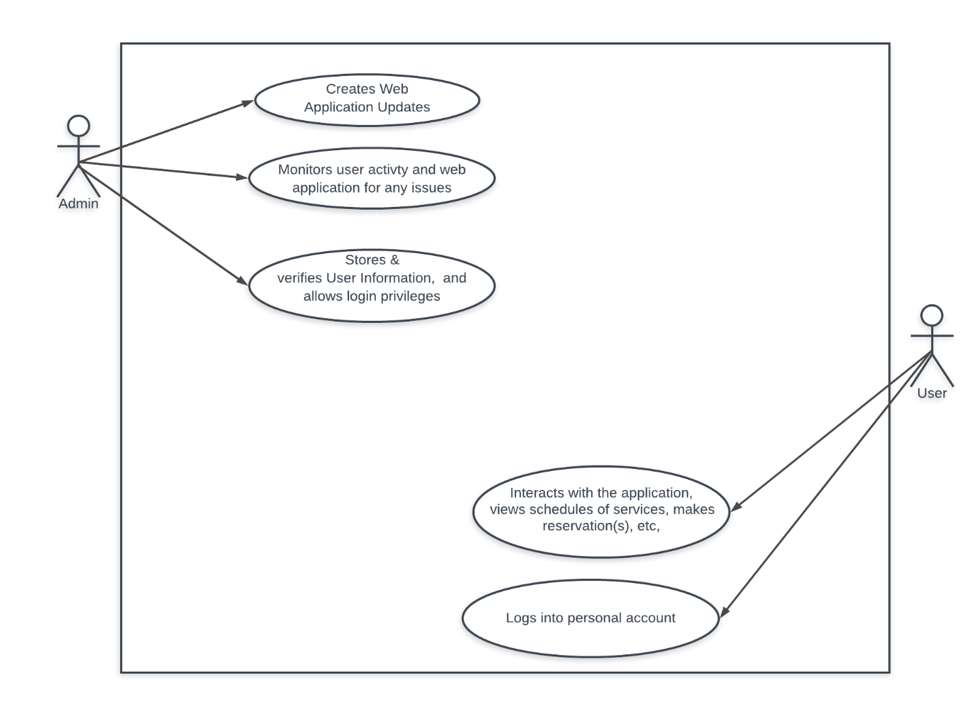
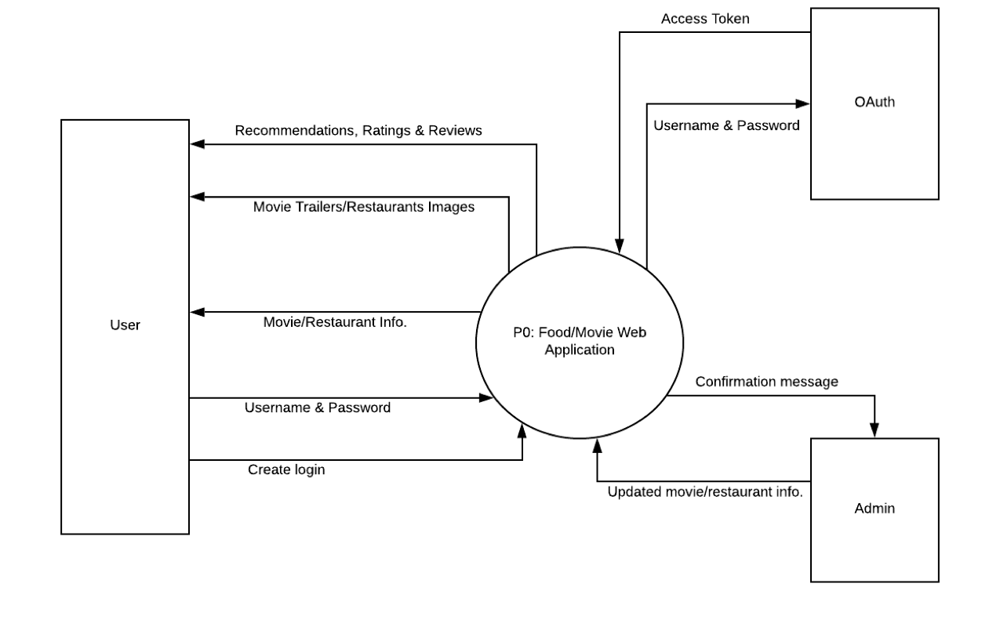
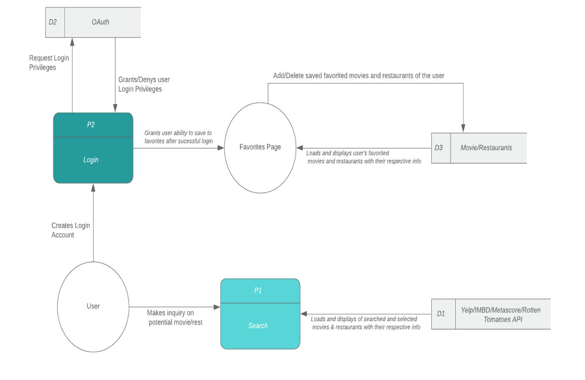
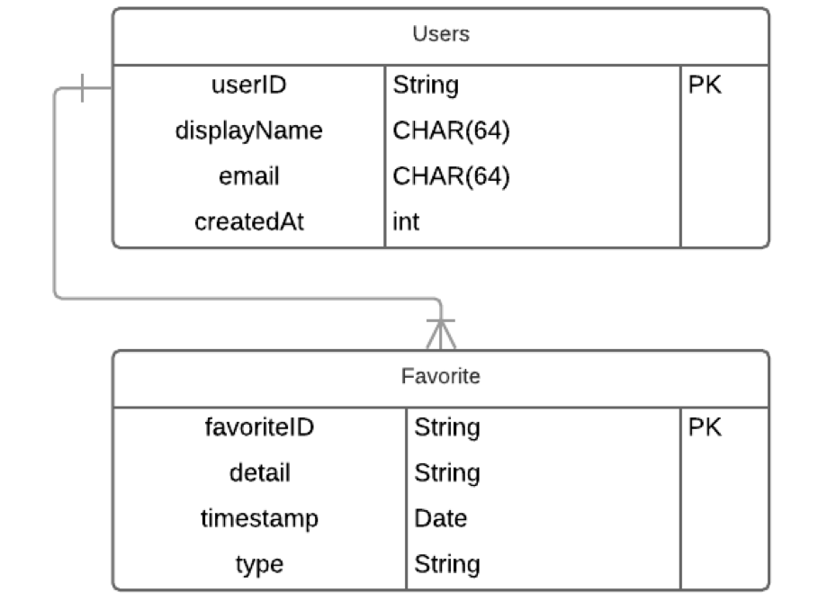
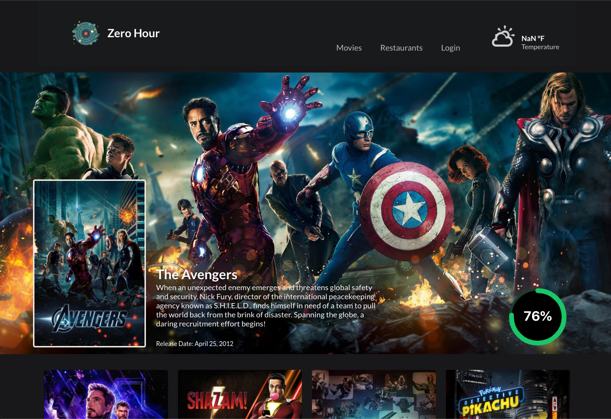
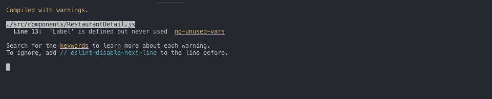
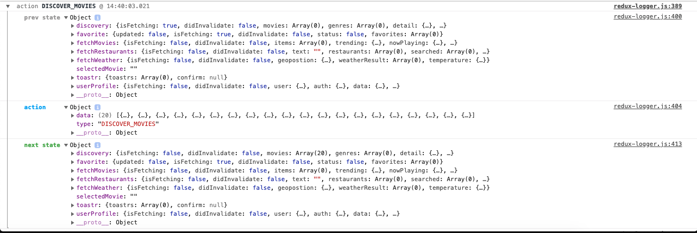
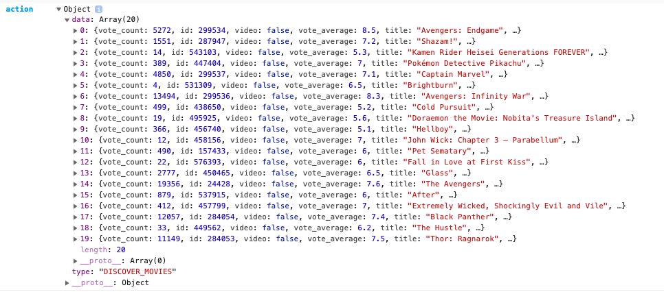
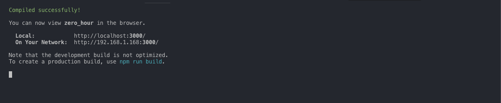

# ZeroHour

> New York Institute of Technology
>
> Department of Engineering and Computer Science
>
> CSCI-665-W01
>
> Software Engineering
>
> Spring 2019

​																																*Oluwatobi Adebiyi*

​																																*Efosa Uwa-Omede*

**Github:** https://github.com/tobhoster/ZeroHour

**URL**: https://zerohour-nyit.firebaseapp.com/

# Abstract

The team of Oluwatobi Adebiyi and Efosa Uwa-Omede, tasked with the mission of building a program displays potentially interesting movies while also giving them the option to explore both favorite and new food venues at their convenience. Technologies such as React.js, Firebase, and Lucid Chart, among others were utilized to develop a program that allows users to explore several types of movie and restaurant services while providing them information based on those services. 

This project is a merger project of Project 6 & 7. The project’s initial plan was to also send alerts for movies and restaurants, for example with a rating of 65% (out of 100%) or higher. Other technologies such as WhatsApp, Rotten Tomato API, Github, and others were used to communicate effectively, reference existing systems, and create a unique product. The purpose of this project was to develop a model where users can decide to arrange for a movie and restaurant outing at the time their convenience all on one platform. 

# **Introduction**

The team of Oluwatobi Adebiyi and Efosa Uwa-Omede, tasked with the mission of building a program displays potentially interesting movies while also giving them the option to explore both favorite and new food venues at their convenience. Technologies such as React.js, Firebase, and LucidChart, among others were utilized to develop a program that allows users to explore several types of movie and restaurant services while providing them information based on those services. Other technologies such as WhatsApp, Rotten Tomato API, Github, and others were used to communicate effectively, reference existing systems, and create a unique product. 

## Purpose

The purpose of this project was to develop an application where users can decide to arrange for a movie and restaurant outing at the time their convenience all on one platform.

## Objectives

Since this project was a merger of Project 6 & Project 7, the goals of this project were to create an application that serves and accomplishes the requirements of both projects. The project’s initial plan was to send alerts for movies and restaurants, for example with a rating of 65% (out of 100%) or higher. It would pull data from APIs such as Google, Yelp, Rotten Tomato, and others regarding restaurants and movie services based on the selected choices and present location of the user. Also, users would be able to make reservations and purchases on site.

## Methodology

1. Plan and submit a detailed proposal of the project that includes an abstract, tools and technologies, existing systems, proposal system details and methods, users, timeline, team members, and skill set.
2. Conduct team meetings to observe progress towards completion of the project.
3. Submit progress reports containing:
4. Context Level Diagram, Data Flow Diagram, Use-Case Diagram. 
5. Design the following: ER-Table Schema diagram
6. Develop an efficient interface using React.js and other technologies for users to interact with.
7. Conduct forms of testing to see if verify and validate that code and interface work properly.
8. Submit technical documentation of the project. 

## Scope

This project was about the creation of an application that introduces users to restaurants and movies service of their choosing and at their location.  This application was a web-based interface best suited and utilized for desktop platforms. The project has a 1.5-month time frame for planning, designing, testing, verification, and deployment while also having a minimal budget for the project.

## Existing Applications:

The application that was developed and deployed based on existing systems such as Netflix, Yelp, Rotten Tomato, IMBD, Metascore, Google Reviews, and other location-based service providers. However, the disadvantages of these applications are the fact that they tend to be singly focused on just movies or restaurant services. 
They don’t provide options or venue information for both services. Also, the interfaces of the older models can be full of clutter, too distracting, and over-stimulating. These interfaces can make it difficult to find what the user is specifically looking for or may be interested in.

## Proposed Idea:

As mentioned before, the older models can make it difficult for users to find and explore exciting venues of entertainment and food with their very cluttered, over-stimulating interfaces and are very limited with their focus. Because the Zero-Hour desktop web application created and the user interface was designed with the ability to allow for login services, save favorites of different services and movie options, perform search queries regarding types of movies and cuisine the user could be interested in, and introduce to potentially new love and exciting services. It would also be clean and to-the-point. Allow users to find and explore new options with ease and comfort.

## **Users Access Level**

| Users Access | Level Privileges                                             |
| ------------ | ------------------------------------------------------------ |
| **Admin**    | Read, Interact, Monitor, Edit, Write, Develop, Update, Search |
| **User**     | Read, Interact, Search                                       |

**Table 1**: A Users Access Level Table that demonstrates the access of users and their respective level privileges 

## **Technologies**

The following list includes the technologies that were utilized in this project:

1. React.js
2. Firebase Firestore
3. Firebase Auth
4. Node.js
5. WhatsApp
6. Github
7. LucidChart
8. API - Rotten Tomato, Netflix, Yelp, Rotten Tomato, IMBD, Metascore, and Google Reviews API  

## Software Engineering Model

The software engineering model that this project was based on was the Waterfall Model (What is the Waterfall Model in SDLC?). The reasons for that are listed below:
•    Requirements are not changing frequently 
•    Application is not complicated and big
•    Project is short
•    Need is clear
•    Environment is stable
•    Technology and tools used are not dynamic and is stable
•    Resources are available and trained 

### Members

**Oluwatobi Adebiyi:** Web, Mobile and Backend Development
**Efosa Uwa-Omede:** Java, Matlab, Web Development, Mechanical Engineering Background

------

## Timeline

1. Proposal and Presentation – **March 13th**
2. Submit progress reports containing: a. Context Level Diagram and Data Flow Diagram, Use-Case – **March 27th - April 10th.**
3. Design the Table schema-ER diagram – **March 27th - April 10th.**
4. Develop an efficient interface for users – **April 24th - May 1st.**
5. Technical documentation of our project – **April 24th - May 15th**
6. Final Presentation – **May 1st**

## **Analysis of the System**

##### Activity List

*A = Top Priority, Very Important & Urgent. Must Do.*

*B = Very Important & Somewhat Urgent. Should Do.*

*C = Important & Somewhat Urgent. Nice to Do.*

*D = Somewhat Important, Not Urgent. Can Do If Able.*

| Date Added | Priority | Project Activity                                             | Lead / Team       | Completion Date |
| ---------- | -------- | ------------------------------------------------------------ | ----------------- | --------------- |
| March 6th  | A        | *Plan and Submit Proposal*                                   | Oluwatobi / Efosa | March 13th      |
| March 6th  | C        | *Conduct Weekly Meetings*                                    | Oluwatobi / Efosa | May 15th        |
| March 27th | B        | *Create Context Level Diagram, Data Flow Diagram, Use-Case Diagram & ER-Table Schema Diagram* | Efosa             | April 10th      |
| March 27th | A        | *Creation of UI by using React.js and Other Technologies*    | Oluwatobi         | April 10th      |
| April 24th | A        | *Create movie and restaurant pages which pulls info on services from the several APIs used in this project, i.e. Yelp, IMBD, MetaScore, etc.* | Oluwatobi / Efosa | May 1st         |
| April 24th | A        | *Create search/select inquiry ability for users to find movies/restaurants by* | Oluwatobi         | May 1st         |
| April 24th | A        | *Create OAuth so that users can login*                       | Oluwatobi / Efosa | May 1st         |
| April 24th | B        | *Create Favorites Pages*                                     | Oluwatobi         | May 1st         |
| April 24th | B        | *Require Users to be login to access favorite pages*         | Oluwatobi / Efosa | May 1st         |
| April 24th | C        | *Allow users to login through sign-up form, Facebook, Google, or Twitter credentials* | Oluwatobi / Efosa | May 1st         |
| April 24th | B        | *Develop a way for users to add and delete saved favorites*  | Oluwatobi         | May 1st         |
| April 24th | D        | *Create a way to send alerts for movies and restaurants*     |                   | *N/A*           |
| April 24th | D        | *Implement a way for users to make payments and reservations for services on the application* |                   | *N/A*           |
| April 24th | B        | *Conduct testing to verify that application works*           | Oluwatobi         | May 1st         |
| April 24th | A        | *Deploy app*                                                 | Oluwatobi / Efosa | May 1st         |
| April 24th | C        | *Begin to write Technical Documentation of Project*          | Efosa             | May 1st         |
| May 1st    | A        | *Presentation*                                               | Oluwatobi / Efosa | May 1st         |
| May 1st    | D        | *Create dummy scheduler for users to see*                    |                   | *N/A*           |
| May 1st    | A        | *Update Diagrams to reflect final status of project*         | Oluwatobi / Efosa | May 15th        |
| May 15th   | A        | *Submit Technical Documentation of project*                  | Oluwatobi / Efosa | May 15th        |

**Table 2:** This table displays the Project Activity, Dates of Start and Completion, The Priority Level of the project activity (Rank A to D), and the members that contributed to that project.

## Diagrams

The following are the diagrams that were created for the project. These diagrams provided good instructions and guidelines for the development of this project.

### Use-Case Diagram



**Diagram 1**: *A Use-Case Diagram showing the capabilities of the user and admin in relation to*
*the web application*


### Context Diagram



**Diagram 2:** *A Context-Level Diagram showing the scope and boundaries of our system*

### Data Flow Diagram



**Diagram 3:** *A Data Flow Diagram that shows the Processes (square with curved edges), External*
*Entities (circle), Data Stores (open rectangle), and Data Flows (straight line with arrowhead to display direction of flow)*

## Database Designs

The Database Design of choice was Firebase FireStore. This NoSQL document database grants easy storing, syncing, and querying data abilities for the web application *(Firebase Auth)*.

### Entity-Relationship – Table Schema Diagram



**Diagram 4:** *An Entity Relationship-Table Schema which shows the cardinality relationship of users to favorites which happens to be “1 to Many”*

## User Interface / System Implementation Details

### **User Interface**

- **React.js:** React makes it painless to create interactive UIs. Design simple views for each state in our application, and React will efficiently update and render just the right components when our data changes. Could use it for mobile applications, either Android or iOS *(React – A JavaScript library for building user interfaces)*. 
  - Semantic UI - Improve the User Experience of the Application
  - Redux - will be used for State-management.
- **Firebase Firestore:** is a NoSQL document database that lets one easily store, sync, and query data for web applications - at a global scale (Firebase FireStore). 
- **Firebase Auth:** Firebase Auth will be utilized to authenticate the users because it aims to make building secure authentication systems easy while improving the sign-in and onboarding experience for the end users (Firebase Auth).
- **Node.js:** is an application runtime environment that allows one to write server-side applications in JavaScript. Node.js will be used for the Backend, to process information like sending notification, training, and prediction using data from Firebase Firestore (Node.js: Using JavaScript on Server-Side).
- **Whatsapp:** For Communication Purposes and Track Team Progress
- **Github & LucidChart:** For project planning & step-by-step project flow chart organization
  Rotten Tomato API or an API of similar ilk: for movie details and rating/notification system reference.

## Files Explanation

### Screenshot of the Landing Page



### Code: Segment – For Authenticating User

```javascript
function getUserState(user, loggedIn) {
  return {
    type: LOGIN_STATE,
    user,
    loggedIn
  };
}

export const loginState = () => dispatch => {
  try {
    firebase.auth().onAuthStateChanged(user => {
      if (user) {
        const userData = {
          displayName: user.displayName,
          email: user.email,
          uid: user.uid
        };
        dispatch(getUserState(userData, true));
      } else {
        dispatch(getUserState(user, false));
      }
    });
  } catch (error) {
    toastr.error(error);
  }
};
```

#### Explanations (For Authenticating User) – Detailed Explanation of Code

The `loginState` observes the user's sign-in state changes. Attach the observer using the `onAuthStateChanged` method. When a user successfully sigins in, you can get information about the user in the observer. `dispatch()` is the method used to dispatch actions and trigger state changes to the store. `loginState` get the user's login state from firebase and dispatches the userData state to `getUserState`

### Code Segments - Discover Resturants

```javascript
// Movies
function getMovieInfo(info) {
  return {
    type: GET_IMDB_INFO,
    info
  };
}

export function getIMDBMovieInfo(id) {
  return dispatch => {
    return axios
      .get(
        `https://api.themoviedb.org/3/movie/${id}?api_key=${
          process.env.REACT_APP_MOVIE_DB_API_KEY
        }&append_to_response=videos,images`
      )
      .then(response => {
        return axios
          .get(
            `http://www.omdbapi.com/?i=${response.data.imdb_id}&apikey=${
              process.env.REACT_APP_OMDB_API_KEY
            }`
          )
          .then(response => response.data)
          .then(info => dispatch(getMovieInfo(info)));
      });
  };
}

// Resturants
function receiveResturants(restaurants) {
  return {
    type: RECEIVE_RESTAURANTS,
    restaurants
  };
}

export function discoverResturants(latitude, longitude) {
  return dispatch => {
    dispatch(fetchResturants(''));
    return axios
      .get(
        `https://cors-anywhere.herokuapp.com/https://api.yelp.com/v3/businesses/search?latitude=${latitude}&longitude=${longitude}`,
        headers
      )
      .then(response => response.data.businesses)
      .then(restaurants => dispatch(receiveResturants(restaurants)));
  };
}
```

#### Explanations – Detailed Explanation of Code

Redux is used to fetch and store the data from the API. Redux is a predictable state container for JavaScript apps. It helps you write applications that behave consistently. The state of the whole application is stored in an object tree within a Redux Store. The State is read-only. The function `discoverResturants`  takes in two parameters - latitude, longitude - uses axios to get businesses from the Yelp API using the user's `latitude` and `longitude`. `axios` returns the data from the API and dispatch the businesses data  to `receiveResturants`.  `discoverResturants` and `getIMDBMovieInfo` are actions. An action is an object that has a property called type. It can also have other properties but for simplicity it will only have type. `dispatch()` is the method used to dispatch actions and trigger state changes to the store. 

## Testing

### Unit Testing





## Results

How do you query your system to generate a summary for all the operations?

### Figures






------


## Conclusion

After merging the objectives and requirements of Project 6 & 7, **Oluwatobi Adebiyi** and **Efosa Uwa-Omede** created a web application that displays potentially interesting movies while also giving them the option to explore both favorite and new food venues at their convenience. **React.js**, **Firebase**, and **LucidChart** among other technologies were required and utilized to develop an interface through OOP that grants users a method of exploring several types of movie and restaurant services. 

Besides, these web applications provide the user information based on those services on one platform when compared to the existing and older system such as *Netflix, Yelp, Rotten Tomatoes, and others*. Despite the obstacles and limitations faced, the web application achieves the vital requirements of both Project 6 and 7.

#### **Team Member Contributions:**

**Leader:** Oluwatobi Adebiyi | **Member 1:** Efosa Uwa-Omede

| Project Activity                                             | Lead / Team     |
| :----------------------------------------------------------- | --------------- |
| *Plan and submit proposal*                                   | Oluwatobi/Efosa |
| *Conduct weekly meetings*                                    | Oluwatobi/Efosa |
| *Create Context Level Diagram, Data Flow Diagram, Use-Case Diagram, & ER-Table Schema Diagram* | Efosa           |
| *Creation of UI by using React.js and other technologies*    | Oluwatobi       |
| *Create movie and restaurant pages which pulls info on services from the several APIs used in this project, i.e. Yelp, IMBD, Metascore, etc.* | Oluwatobi/Efosa |
| *Create search/select inquiry ability for users to find movies/restaurants by* | Oluwatobi       |
| *Create OAuth so that users can login*                       | Oluwatobi/Efosa |
| *Create Favorites Pages*                                     | Oluwatobi       |
| *Require Users to be login to access favorite pages*         | Oluwatobi/Efosa |
| *Allow users to login through sign-up form, Facebook, Google, or Twitter credentials* | Oluwatobi/Efosa |
| Develop a way for users to add and delete saved favorites    | Oluwatobi       |
| *Create a way to send alerts for movies and restaurants*     |                 |
| *Implement a way for users to make payments and reservations for services on the application* |                 |
| *Conduct testing to verify that application works*           | Oluwatobi       |
| *Deploy app*                                                 | Oluwatobi/Efosa |
| *Begin to write Technical Documentation of Project*          | Efosa           |
| *Presentation*                                               | Oluwatobi/Efosa |
| *Create dummy scheduler for users to see*                    |                 |
| *Update Diagrams to reflect final status of project*         | Oluwatobi/Efosa |
| *Submit Technical Documentation of project*                  | Oluwatobi/Efosa |

**Table 3:** *This table is an excerpt from the **Table 2**, The Project Activity List Table, displaying the Project Activity task and the members that contributed to each task*


## Learning Outcome

**Efosa:** Construction of SE Diagrams, Software Application Development Stages, Exposure to NoSQL and API’s, Exposure to new software technologies and OOPs.

**Oluwatobi:** Using Redux for State Management, Using Firebase Auth Web, Exposure to open-source API 

### Limitations:

•    Only 1.5 months to complete project
•    The budget was very low to none existent
•    Restricted to freeware
•    Less than half the members of all the other teams 

## Challenges

A lot of the difficulties that arose from the development of this web application can be traced back to the combining of two different projective objectives, Project 6 & 7. This required double work with less than half the members of all the other teams also taking the same course. This naturally presented obstacles along the way.  The following are three objectives that were initially to be completed:

•    Sending alerts for movies and restaurants
•    Implement a way for users to make payments and reservations for services on the application
•    Creating dummy scheduler for users to see

Due to budget limitations, software availability restrictions, time constraints, and workforce constraints, other goals and objectives had to be prioritized higher to deliver a compelling user interface while still completing the most vital tasks promptly. Unfortunately, those three objectives were not achieved.


## References

- **Data Flow Diagram** - Oxynoia-se. (n.d.). Retrieved from https://sites.google.com/site/oxynoiase/data-flow-diagram
- **Firebase Auth.** (n.d.). Retrieved from https://firebase.google.com/products/auth
- **Firebase Firestore.** (n.d.). Retrieved from https://firebase.google.com/products/firestore/?hl=zh-TW
- **Node.js** - Foundation. (n.d.). Retrieved from https://nodejs.org/en/
- **Node.js:** Using JavaScript on Server-Side. (2018, August 30). Retrieved from https://www.simplytechnologies.net/blog/2018/4/30/nodejs-using-javascript-on-server-side
- **Online Diagram Software & Visual Solution.** (n.d.). Retrieved from https://www.lucidchart.com/
- **Online Diagram Software & Visual Solution.** (n.d.). Retrieved from https://www.lucidchart.com/
- **ProgrammableWeb.** (n.d.). Retrieved from https://www.programmableweb.com/
- **Project Management Activity List.** (n.d.). Retrieved from http://www.smorad.com/project-management-activity-list-template/activity-list-template-project-management-software-task-word-in-4/
- **React – A JavaScript library for building user interfaces.** (n.d.). Retrieved from https://reactjs.org/
- **What is Waterfall Model in SDLC? Advantages & Disadvantages.** (n.d.). Retrieved from https://www.guru99.com/what-is-sdlc-or-waterfall-model.html
- **WhatsApp.** (n.d.). Retrieved from https://www.whatsapp.com/